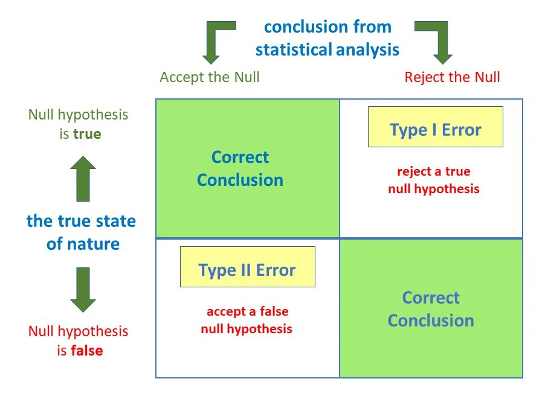

# 2.  **Inferential statistics**
Inferential statistics is a subfield of statistics that focuses on drawing conclusions or making predictions about a larger group (population) through a smaller group (sample) of individuals based on some information collected from them. By applying different methods in statistics, it enables one to make assumptions regarding the main features of people’s lives like population average, percentage and relationship among variables using a limited set of observed values.
## 1.**Hypothesis Testing**
Hypothesis testing involves making decisions about a population parameter based on sample data. It generally consists of stating a null hypothesis, often denoted as H0, and an alternative hypothesis, often denoted as Ha, in addition to collecting sample data and then using statistical tests to see whether there is enough evidence to reject the null hypothesis in favor of the alternative hypothesis.
- Null Hypothesis(H0): This is a general statement or default position of two measured cases where nothing has happened. In other words, there is no relationship between them, or no relationship among groups. It means a basic assumption or made based on the problem knowledge.
- Alternative hypothesis (H1):The alternative hypothesis represents the alternative being tested in the hypothesis testing and is opposite to null hypothesis.

**Step to testing Hypothesis Testing**

- **Level of significance** : It is the amount of confidence that we want on accepting or rejecting the null hypothesis. While accepting the hypothesis, we can't gain 100% accuracy. Normally consider the significance level as 5%. Usually, α = 0.05 or 5% which states that with 95% confidence level, the output would be same for any kind of sample population.
- **p-value**: The probability of obtaining the observed/ extreme results, assuming that the null hypothesis H0 is true. If the p-value obtained is less than the significance level, then we reject the null hypothesis.
- **Test Statistic**: The numerical value computed from the sample data in testing a hypothesis, which is compared to the rejection region or critical values to decide whether to reject the null hypothesis.
- **Critical Value**: The value of a test statistic that a null hypothesis is rejected if the value of test statistic either greater than or less than.

- **Degree of Freedom**: The degree of freedom pertains to the variability or freedom one has in estimating a parameter. It is related to sample size and determines the shape of the distribution.

**type of Hypotheis Testing**
- **Single-tailed test**

    - **Left-Tailed or Left-Sided Test**: The alternative hypothesis offers the statement that the true value of the parameter is less than the null hypothesis.Example:  and 
    - **Right-Tailed (Right-Sided) Test**: This type of test represents that the alternative hypothesis asserts that the actual value of the parameter is greater than the value included in the null hypothesis. 
    Example:  and 
- **Two-Tailed Test**
A two-tailed test takes into account both the greater than and less than in direction against a given value. We use a two-tailed test when there isn't any explicit expectation in either direction and we want to find out any significant difference.
Example: H0: μ= 50 and H1: μ≠50

**Test Statistic:**

- **Z-test**: Widely used in cases when the sample size is greater and the standard deviation of the population is known. Employed during the comparison between different samples or groups to draw inductive interference for populations. Emphasis on the probability of observing data given that some premises or hypotheses are valid. Provide a framework for assessing the evidence supporting as well as opposing a specific.

   

    Where

    Z is the test statistic

    x is the sample mean

    μ is the hypothesized population mean

    σ is the population standard deviation

    n is the sample 

- **T-Test**: A test applied for finding a significant difference between the means of two groups. It is a test most often used when data is normally distributed and the population variances are unknown. T-test is one of the test procedures in hypothesis testing in which it tests whether a difference between two groups really exists, or is it because of chance.

- **Chi-square test**: The Chi-square test is a statistic utilized in an attempt to prove the existence of any significant relationship between two nominal measures. It has a very broad application in testing whether two variables are independent and the differences between observed frequencies in a contingency table and frequencies that would be expected under independence.

**P-value**

P-Value Interpretation

- **P-value > 0.05**: The result is not statistically significant, so do not reject the null hypothesis.
  
- **P-value < 0.05**: The result is statistically significant. Generally, reject the null hypothesis in favor of the alternative hypothesis.

- **P-value < 0.01**: The result is highly statistically significant, thus reject the null hypothesis in favor of the alternative hypothesis.

**Type I & Type II Errors** 

**Type 1 Error (α-error)**

A type 1 error, also called an α-error, happens when a true null hypothesis is rejected. In other words, this means that there is a statistically significant difference or relationship found by the test when the reality is that there is no real difference or relationship.

**Type 2 Error (β-error)**

A Type 2 error, which occurs when a false null hypothesis is not rejected, is also called the β-error. This relates to the failure of a test in finding a difference or relationship that is statistically significant when, actually, there is a real difference or relationship.

## 2.**Regression**
Regression is a statistical analysis used for determining the relationship between two or more variables. It involves modeling the relationship between a dependent variable, known as the outcome variable, and one or more independent variables, also known as predictor variables.

**Important Concepts in Regression Analysis**

- **Dependent Variable (y)**: This is the variable of interest that you want to predict or explain.
- **Independent Variable(s) x**: The variable used to predict the dependent variable.
- **Regression Coefficient:** It is the change in the dependent variable, which occurs for one unit of variation in the independent variable.
- **Intercept (α):** The value of the dependent variable when the independent variable is zero.
- **Coefficient of Determination (R squared):** Describes what percentage of the variation in the dependent variable is determined (or explained) by the independent variables.\

**Types of Regression Analysis** 

1. **Simple Linear regression:** Simple linear regression is a type of regression that is used when a single independent variable predicts a dependent variable.

   
where,
 is the dependent variable.
 is the independent variable.
 is the intercept, which marks the value of  when  = 0.
b is the slope showing the change in  given a one-unit change in .

2. **multiple regression:** In multiple regression, the linear regression is extended to include more than one independent variable to predict the dependent variable. It takes the form 
    
    
    where,
     = dependent variable,
     = independent variables,
     = intercept, and
     = independent variable coefficients.
3. **Non-Linear Regression :** Non-Linear Regression is a statistical technique used to model relationships where the connection between independent variable  and the dependent variable is not linear. This approach is necessary when a linear model does not adequately describe the data.
- **Polynomial Regression**
Polynomial Regression uses a polynomial equation to model the relationship between the variables.

    **Formula:**
    

 : Dependent variable

 : Independent variable

: Coefficients

: Degree of the polynomial

(ϵ): Error term
- **Logarithmic Regression**
Logarithmic Regression uses a logarithmic equation to model the relationship, applying the natural logarithm to the independent variable.

    **Formula:**
    

 : Natural logarithm of the independent variable x

 : Intercept

 : Coefficient for the logarithmic term

 : Error term
- **Exponential Regression**
Exponential Regression models the relationship using an exponential function, capturing growth or decay.

    **Formula:**
    

: Euler's number (approximately 2.718)

 : Coefficient

 : Rate of growth or decay

 : Error term.

4. **Logistic Regression**

Logistic Regression is a type of regression analysis used for binary outcome variables (e.g., 0/1, yes/no). It is commonly used in situations where the dependent variable is a binary outcome
Logistic Regression uses a logistic function to model the probability of the dependent variable being in one of the two categories. The logistic function is an S-shaped curve that maps the input values to probabilities between 0 and 1.

**Logistic Function:** The core of logistic regression is the logistic function (also known as the sigmoid function), which maps any real-valued number into the range of 0 to 1. The formula for the logistic function is:

Where:
-  is the value of the logistic function for input .
-  is a real-valued number, typically a linear combination of predictor variables.
-  is the base of the natural logarithm (approximately equal to 2.71828).

**Key Concepts**

**Odds Ratio**

The **odds ratio** measures the change in the odds of the dependent variable being in one of the two categories for a one-unit change in the independent variable. It is a measure of association between an exposure and an outcome. 

- **Interpretation**: An odds ratio greater than 1 indicates that as the independent variable increases, the odds of the dependent variable being in the "success" category increase. An odds ratio less than 1 indicates a decrease in the odds.

**Logit**

The **logit** is the logarithm of the odds ratio and is used to model the relationship between the independent variable(s) and the dependent variable. It is expressed as:

Where:
-  is the probability of the dependent variable being in the "success" category.
-  represents the odds of the dependent variable being in the "success" category.
-  denotes the natural logarithm.

5. **Poisson Regression**

**Overview**

Poisson regression is a type of regression analysis used for count data, such as the number of accidents or events occurring in a fixed interval of time or space. It is suitable for modeling count data when the dependent variable represents the number of times an event occurs.

Poisson regression uses a Poisson distribution to model the count data. The Poisson distribution is a discrete distribution that describes the probability of a given number of events occurring within a fixed interval.

**Key Concepts**

**Lambda (λ)** represents the average rate of events occurring in a fixed interval of time or space. It is the parameter of the Poisson distribution and indicates the expected number of events per interval.

- **Interpretation**: A higher lambda value indicates a higher average rate of events.

**Exposure** refers to the amount of time or space over which the events occur. In Poisson regression, exposure is often used to adjust the count data to account for varying lengths of observation time or different areas of space.

- **Adjustment**: The model adjusts the count data based on the exposure to ensure accurate estimates of the event rates.

**Poisson Regression Model**

The Poisson regression model can be expressed as:

Where:
-  is the expected count of events.
-  is the intercept.
-  are the coefficients for the predictor variables .

## **Confidence Intervals**
A confidence interval is a range of values within which the true population parameter is likely to lie. It provides a statistical tool to estimate the population parameter with a certain level of confidence, incorporating a margin of error.

**Sample Statistic**

The **sample statistic** is a characteristic of the sample, such as the sample mean or sample proportion. It is used as an estimate of the population parameter.

**Standard Error**
The standard error is a measure of the variability or dispersion of the sample statistic. It quantifies how much the sample statistic is expected to fluctuate from one sample to another.

- **Calculation**: For the sample mean, the standard error is calculated as:
  
  where  is the population standard deviation and  is the sample size.

**Margin of Error**

The margin of error is the maximum amount by which the sample statistic may differ from the true population parameter. It is determined based on the standard error and the desired confidence level.

- **Calculation**: The margin of error (ME) is calculated as:
  
  
where the Critical Value depends on the confidence level (e.g., 1.96 for a 95% confidence level).

**Confidence Level**

The confidence level is the probability that the confidence interval contains the true population parameter. It reflects how certain we are that the interval covers the true parameter.

- **Common Levels**: 90%, 95%, and 99%.
- **Interpretation**: A 95% confidence level means that if we were to take many samples and construct confidence intervals for each, approximately 95% of those intervals would contain the true population parameter.

**Confidence Interval Formula**

For a mean, the confidence interval is calculated as:

Where:
-   is the sample mean.
- **Critical Value** is based on the chosen confidence level (e.g., 1.96 for 95% confidence).
- **SE** is the standard error of the mean.

##  **Correlation**

Correlation One process for establishing the relationships between two variables. You learned one way to get a general idea about whether or not two variables are related, is to plot them on a "scatter plot". While there are many measures of association for variables which are measured at the ordinal or higher level of measurement, correlation is the most commonly used approach.

Correlation applies to ordinal, interval, and ratio variables but is not suitable for nominal variables.

The **Correlation Coefficient**, often represented as r, is a statistical measure that quantifies the strength and direction of the linear relationship between two variables. It takes values between -1 and 1

r=1 indicates a perfect positive correlation, meaning as one variable increases, the other also increases in a perfectly linear manner.

r=−1 indicates a perfect negative correlation, meaning as one variable increases, the other decreases in a perfectly linear manner.

r=0 indicates no linear relationship between the variables.

**KEY POINTS:**
**Positive correlation:** As one variable increases, the other tends to increase.

**Negative correlation:** As one variable increases, the other tends to decrease.

**Magnitude:** The closer r is to 1 or -1, the stronger the relationship; the closer r is to 0, the weaker the relationship.

The formula for Pearson's correlation coefficient is:

Where:
-  is the number of data points.
-  and  are the two variables being compared.
-  is the sum of the product of paired values.
-  is the sum of the  -values.
-  is the sum of the  -values.
-  is the sum of squared  -values.
-  is the sum of squared  -values.

The strength of the correlation is classified as follows:

- **Strong Correlation**: 
  - Indicates a strong linear relationship between the variables.
- **Moderate Correlation**: 
  - Indicates a moderate linear relationship between the variables.
- **Weak Correlation**: 
  - Indicates a weak linear relationship between the variables.

